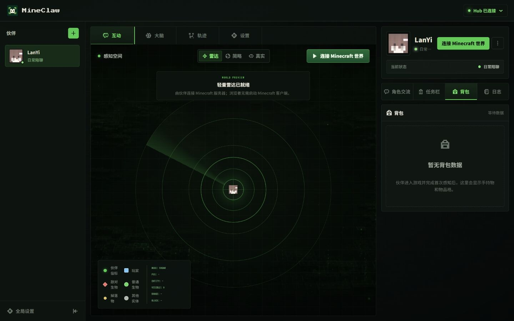

<p align="right">
  <a href="./README.md">简体中文</a> · <strong>English</strong>
</p>

<p align="center">
  
</p>

<h1 align="center">MineClaw</h1>

<p align="center">
  <strong>An embodied AI companion that lives, talks, acts, and grows with you inside Minecraft.</strong>
</p>

<p align="center">
  
  
  
  
</p>

<p align="center">
  <a href="#why-mineclaw">Why MineClaw</a> ·
  <a href="#what-it-can-do">Capabilities</a> ·
  <a href="#architecture">Architecture</a> ·
  <a href="#quick-start">Quick Start</a> ·
  <a href="#development">Development</a> ·
  <a href="#contributing">Contributing</a>
</p>

---

## Why MineClaw

MineClaw explores a simple idea: an AI companion should be more than a chat window. It should share the same world as the player, understand natural-language goals, take real actions, observe their effects, and speak honestly about what happened.

The project combines a Mineflayer body, an LLM-driven companion and goal loop, a local observability console, and repeatable tests and benchmarks. The result is a companion that can chat casually, join the player in Minecraft, and work toward concrete changes in the world.

<p align="center">
  
</p>

## What It Can Do

MineClaw is built around a verifiable companion loop rather than one-shot command execution.

| Capability | What it means |
|---|---|
| Companion conversation | Maintains a distinct voice and separates everyday conversation from game-task execution. |
| Embodied Minecraft control | Reads live position, health, inventory, nearby blocks and entities through a Mineflayer-controlled body. |
| Goal-driven action | Interprets a player goal, plans steps, invokes reusable capabilities, and adjusts when the world does not match the plan. |
| World-state verification | Uses inventory, block, container, distance, and other game evidence before reporting success. |
| Memory and reusable skills | Records useful experience and retrieves relevant knowledge or strategies for later goals. |
| Local observability | Exposes conversation, task progress, model calls, events, and completion evidence in a local console. |
| Repeatable evaluation | Keeps product tests and capability benchmarks in versioned, runnable workspaces. |

> MineClaw is under active development. Capability coverage varies by Minecraft version, server configuration, available materials, and model provider.

## Architecture

The runtime keeps conversation, goal execution, game control, evidence, and observability connected without treating them as one monolithic agent.

```text
Player
  │
  ├── conversation ──> MainBrain ───────────────┐
  │                                              │
  └── game goal ─────> GoalAgent loop            │
                         │                        │
                         ├── plan / recover       │
                         ├── skills / strategies  │
                         ├── capabilities         │
                         └── world verification   │
                                  │               │
                                  v               v
Minecraft server <──> Mineflayer adapter      Memory & traces
                                  │               │
                                  └──────> Local web console
```

The main source areas are:

```text
MineClaw/
├── apps/
│   ├── minecraft-companion/      # Runtime, Electron shell and Vue console
│   └── minefriend-site/          # Standalone product website
├── test-case/                    # Functional and regression test workspace
├── benchmark/                    # Capability and engineering evaluation suites
├── scripts/                      # Release and workspace validation tools
├── AGENTS.md                     # Public contribution rules for agents and people
├── CONTRIBUTING.md               # Contribution workflow
└── SECURITY.md                   # Security reporting policy
```

## Quick Start

### Prerequisites

- Node.js 22 or later
- A reachable Minecraft Java Edition server
- An OpenAI-compatible LLM endpoint and API key

Minecraft worlds, server binaries, credentials, local databases, logs, and agent memory are intentionally not included in this repository.

### 1. Start the companion runtime

```bash
cd apps/minecraft-companion
npm ci
cp .env.example .env
npm run dev
```

On Windows PowerShell, create the environment file with:

```powershell
Copy-Item .env.example .env
```

Edit `.env` with your own Minecraft server and model-provider settings. Never commit this file.

### 2. Start the local console

In a second terminal:

```bash
cd apps/minecraft-companion/web
npm ci
npm run dev
```

The runtime and console are separate development processes. Keep both running while using the browser-based control surface.

### 3. Run the product website

The standalone MineClaw website can be developed without the bot or Minecraft server:

```bash
cd apps/minefriend-site
npm ci
npm run dev
```

## Development

### Quality checks

Run the repository boundary check and the builds relevant to your change:

```bash
node scripts/check-release.mjs

cd apps/minecraft-companion && npm run build
cd web && npm run build

cd ../../minefriend-site && npm run build
```

Backend behavior changes should also run the focused `npm run test:v2` subset or the full applicable test suite. Benchmark commands and profiles live under [`benchmark/`](benchmark/), while functional and regression coverage lives under [`test-case/`](test-case/).

### Repository boundaries

This repository contains publishable source code, tests, benchmarks, configuration templates, and website assets. Keep the following outside version control:

- `.env` files and credentials
- Minecraft worlds, player data, server binaries, and RCON details
- runtime databases, logs, caches, build output, and agent memory
- private workspace metadata or private documentation

The release boundary is enforced by [`scripts/check-release.mjs`](scripts/check-release.mjs).

## Contributing

Read [CONTRIBUTING.md](CONTRIBUTING.md) before opening a change. Keep each contribution focused, add or update relevant tests, and describe the user-visible result and validation performed.

For repository-specific coding and agent rules, see [AGENTS.md](AGENTS.md). To report a vulnerability or sensitive issue, follow [SECURITY.md](SECURITY.md) and do not publish secrets or private server details in an issue.

## License

This repository does not currently include an open-source license grant. Unless and until the project owner adds one, the source may be viewed but must not be copied, redistributed, or reused as though it were open source.

---

<p align="center">
  <strong>MineClaw — a companion who shares the world, not just the chat.</strong>
</p>
