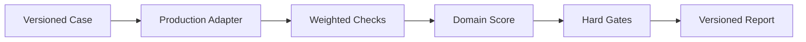

# Benchmark Spec · MineClaw Unified Memory Benchmark v1

## 1. 规范总览

一个正式结果由 `Case → Check → Domain → Gate → Report` 五层组成；每层必须保留可回溯证据。

## 2. Case 契约

| 字段 | 约束 |
|---|---|
| `id` | 永久唯一，版本内不得复用 |
| `domain` | 必须已注册 Adapter |
| `split` | `dev` 或 `test` |
| `critical` | 标记该 Case 是否含发布硬门 |
| `tags` | 描述能力切片，不参与业务分支 |
| `input` | 可重放 Fixture |
| `expected` | 可机器判定 Ground Truth |

生产代码不得读取 `id`、expected 或报告路径。

## 3. Check 契约

每个 Check 必须包含 `id/kind/passed/weight/critical/expected/actual/evidence`。

`passed` 只能来自可执行比较；`evidence` 必须是 Trace、计数、坐标、sourceRef 或明确错误，不得只写“已验证”。

## 4. 域定义

### 4.1 chat

验证事实 Capture、CRUD、冲突、拒存、Retrieve@5、Context Evidence、预算和 Profile 隔离。

旧中文130题作为兼容源接入；其 Answer 指标在本规范中重命名为 `context_evidence`。

### 4.2 explicit_place

验证 LLM 工具等价生产入口 `remember_place`、语义名称、类型、坐标、直接召回、重启与统一召回可见性。

### 4.3 auto_discovery

验证 WorldScan/MineralProbe 的自动发现、误报/漏报、元数据、坐标、去重、重启和统一召回可见性。

### 4.4 episode_location

验证 Episode 的地点、环境、参与者、关键事件、结果、sourceRefs、重启、地点索引、Profile 隔离和深度召回。

## 5. 隔离与可复现

- 每个 Case 创建独立临时目录和 SQLite。
- Case 完成后关闭连接并清理临时目录。
- 不读取用户真实 Profile 数据库。
- 报告记录 Git commit、配置哈希、数据集哈希、版本与 Profile。
- quick/full 固定 `externalLlmRequests=0`。

## 6. Profile

| Profile | 范围 | 用途 |
|---|---|---|
| quick | 20 Case | 提交前快速检查 |
| full | 141 Case | 本地完整确定性基线 |
| live | 未在v1启用 | 训练服真实摆场与进程重启 |
| judged | 未在v1启用 | 真实 LLM Answer/Judge |

## 7. 报告契约

JSON Schema 版本为 `mineclaw-memory-benchmark-report/v1`，Markdown 必须由同一个内存对象生成。

能力失败仍应尽量生成完整报告；Adapter 异常转换为 critical `adapter_execution` Check，Runner 继续其他 Case。
